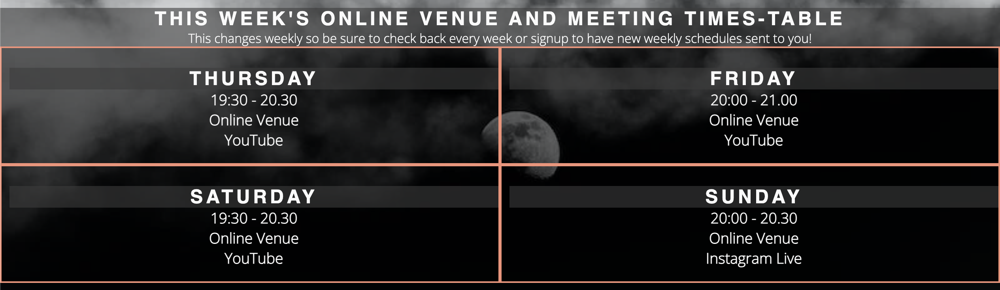
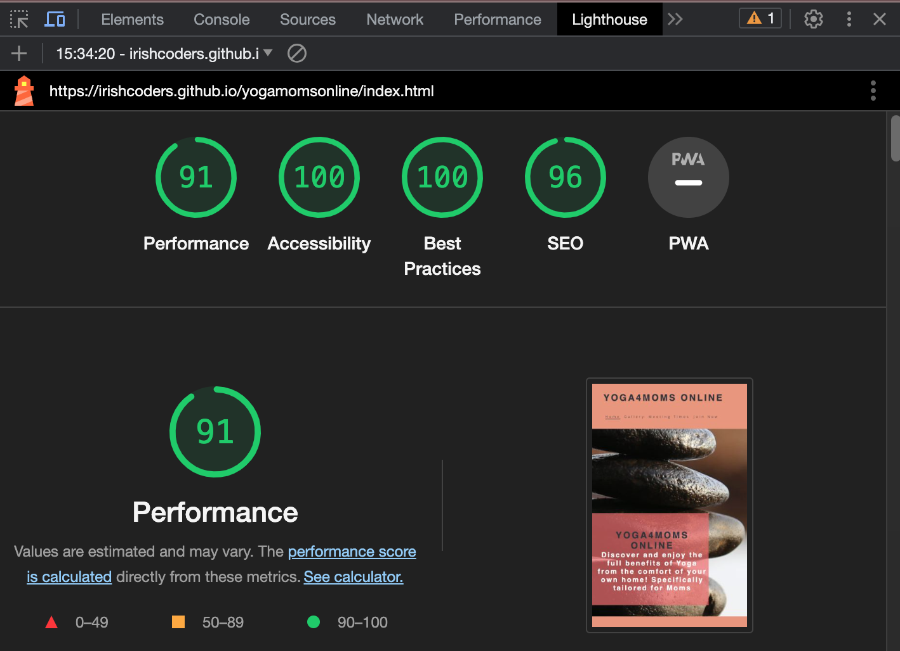

# Yoga4Moms Online

Yoga4Moms Online is a website designed to encourage moms of all ages to participate in online Yoga sessions. The platform aims to help moms maintain their health through Yoga while providing a space to connect with like-minded individuals. Yoga4Moms Online offers information about upcoming Yoga sessions, online events, and more.
Visit the live site here: [Yoga4Moms Online](https://irishcoders.github.io/yogamomsonline/)

## Features

### Navigation Bar

- The responsive navigation bar appears on all pages, allowing easy access to the Home page, Gallery, Meeting Times and the Join Us page.
- Seamless navigation enhances the user experience across devices.

### Landing Page

- The landing page features an engaging photograph with text overlay, effectively conveying the purpose and target audience of the website.
- A captivating animated hero image display introduces users to Yoga4Moms Online.

### Reasons to Join 'Yoga4Mom Online' Section

- This section highlights 6 essential benefits of joining the Yoga online community, emphasizing the value of Yoga for overall well-being.
- Compelling images depict moms of different ages practicing Yoga, inspiring users to consider Yoga as their fitness choice.

### Meeting Times Section

- Users can easily access information about upcoming meeting times, locations, and session durations.
- The section is regularly updated to keep users informed.

### Gallery

- The gallery showcases a diverse collection of images, providing users with a visual insight into Yoga sessions and events.
- Users gain a better understanding of the organization's offerings.

### Join Us Page

- Users can register for Yoga4Moms Online, specify their Yoga experience level and preferences.
- The page captures essential user details such as user first name, last name and email address for account creation.
- The page has a feedback area where users can enter their comments about how they think we can improve their experience on the website.

### Footer

- The footer features links to relevant social media platforms, facilitating easy interaction and connection between users and site owner.
- Copyright information indicates the site's in date and it is valid.

## Features Left to Implement

- Live chat support for users seeking immediate assistance.

## Testing

- Tested navigation links to ensure accurate routing and smooth user experience.
- Confirmed that the header, Reasons To Join, Meeting Times and Join Us page texts are all readable and easy to understand.
- Tested and confirmed website runs correctly across different platforms like Chrome, Firefox and Safari.
- Conducted extensive responsiveness testing across various devices using the devtools device toolbar and confirmed that it works well across various devices.
- Tested using LightHouse to determine Assesibility, Performance and SEO.
- Implemented masonry layout for the gallery and tested for consistency.
- Verified that linkage of footer elements redirects to the correct social media sites.

## Debugging

### Validator Testing

- HTML code was validated using the [W3C validator](<https://validator.w3.org/nu/#textarea>) and passed without errors.
- CSS code was validated using the [Jigsaw validator](<https://jigsaw.w3.org/css-validator/validator>) and found to be error-free.

### LightHouse Performace Score

### Solved Bugs

When the project was deployed to GitHub pages, it was discovered that some vital things do not work like the links to social media sites on the footer, the images on readme page not showing, some unclosed tags issues and responsiveness issues. Below is a detailed explanation of how each issue was resolved.

- Unclosed `html` tags were closed and the issue have been resolved.
- Missing `css` file issues have been resolved by fixing the google font import link in the style page.
- Broken social media links on gallery and signup pages fixed by fixing the code for each individual pages.
- Missing README images and descriptions were fixed by pointing the images to the right location/folders.
- Padding added to Meeting Times Section style and border lines adjusted for easier user readability.
- Clearer seperation and sectioning between header and body paragraphs implemented.
- Logo and Menu Nav media query fixed for better visual display on small and medium screen sizes
- Form page was tested to make sure all input fields accepts the correct format and the submit button works properly.
  
### Unfixed Bugs

No unfixed bugs

## Deployment

  The website was deployed to GitHub Pages using the following steps:

  1. Navigate to the GitHub repository's Settings tab.
  2. Select the Master/Main Branch as the source for deployment.
  3. Once Master/Main Branch is selected, navigate to Pages tab where you can find the link to the live website.
  4. If you find the live link generated by Github, the deployment process has been succesful.

Visit the live site here: [Yoga4Moms Online](https://irishcoders.github.io/yogamomsonline/)

# Credits

- Fonts from Google Fonts were used for the Home page typography.
- Form validation guidance was sourced from the Love Running Final Challenge.
- Icons in the Reasons section, footer, and Join Us pages were provided by Font Awesome.
- The website design was inspired by CodeInstitute's Love Running Tutorials.
- Images on the home and Join Us pages were sourced from PEXELS ([www.pexels.com](<https://www.pexels.com>)) and iSTOCKPHOTO ([www.istockphoto.com](https://www.istockphoto.com)).
