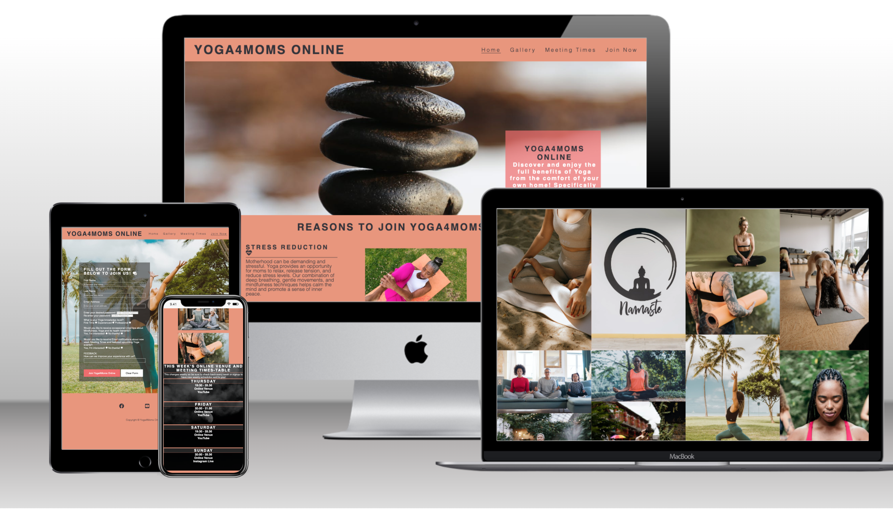

# Yoga4Moms Online

Yoga4Moms Online is a website designed to encourage moms of all ages to participate in online Yoga sessions. The platform aims to help moms maintain their health through Yoga while providing a space to connect with like-minded individuals. Yoga4Moms Online offers information about upcoming Yoga sessions, online events, and more.

## Features

### Navigation Bar

- The responsive navigation bar appears on all pages, allowing easy access to the Home page, Gallery, Meeting Times, and [Join Us](<https://irishcoders.github.io/yogamomsonline/signup.html>) page.
- Seamless navigation enhances the user experience across devices.

### Landing Page

- The landing page features an engaging photograph with text overlay, effectively conveying the purpose and target audience of the website.
- A captivating animated hero image display introduces users to Yoga4Moms Online.

### Reasons to Join 'Yoga4Mom Online' Section

- This section highlights the benefits of joining the Yoga online community, emphasizing the value of Yoga for overall well-being.
- Compelling images depict moms of different ages practicing Yoga, inspiring users to consider Yoga as their fitness choice.

### Meeting Times Section

- Users can easily access information about upcoming meeting times, locations, and session durations.
- The section is regularly updated to keep users informed.

### Gallery

- The gallery showcases a diverse collection of images, providing users with a visual insight into Yoga sessions and events.
- Users gain a better understanding of the organization's offerings.

### Join Us Page

- Users can register for Yoga4Moms Online, specifying their Yoga experience level and preferences.
- The page captures essential user details for account creation.

### Footer

- The footer features links to relevant social media platforms, facilitating easy interaction and connection.
- Copyright information indicates the site's currency and validity.

## Features Left to Implement

- Live chat support for users seeking immediate assistance.

## Testing

- Tested navigation links to ensure accurate routing and smooth user experience.
- Successfully tested form GET and POST functionality.
- Debugged code using inspect element to fine-tune styling.
- Conducted extensive responsiveness testing across various devices.
- Tested using LightHouse to determine Assesibility, Performance and SEO.
- Implemented masonry layout for the gallery and tested for consistency.
- Verified correct linkage of footer elements to social media sites.

## Debugging

- HTML code was validated using the [W3C validator](<https://validator.w3.org/nu/#textarea>) and passed without errors.
- CSS code was validated using the [Jigsaw validator](<https://jigsaw.w3.org/css-validator/validator>) and found to be error-free.
- Unclosed `html` tags have been resolved during debugging.
- Missing `css` file issues have been resolved by fixing the google font import link.
- Broken social media links on gallery and signup page fixed by fixing the code for each individual pages.
- Missing README images and descriptions fixed.
- Padding added to Meeting Times Section style for easier user readability.
- Clearer seperation and sectioning between header and body paragraphs implemented.
- Logo and Menu Nav media query fixed for better visual display on small and medium screen sizes
  
## Unfixed Bugs

- Ongoing work to further refine media queries for optimal homepage header display on smaller and medium screens.

## Deployment

  The website was deployed to GitHub Pages using the following steps:

  1. Navigate to the GitHub repository's Settings tab.
  2. Select the Master/Main Branch as the source for deployment.
  3. The deployment was confirmed with a ribbon display and a live link was generated by Github.

Visit the live site here: [Yoga4Moms Online](https://irishcoders.github.io/yogamomsonline/)

# Credits

- Fonts from Google Fonts were used for the Home page typography.
- Form validation guidance was sourced from the Love Running Final Challenge.
- Icons in the Reasons section, footer, and Join Us pages were provided by Font Awesome.
- The website design was inspired by CodeInstitute's Love Running Tutorials.
- Images on the home and Join Us pages were sourced from PEXELS ([www.pexels.com](<https://www.pexels.com>)) and iSTOCKPHOTO ([www.istockphoto.com](https://www.istockphoto.com)).
